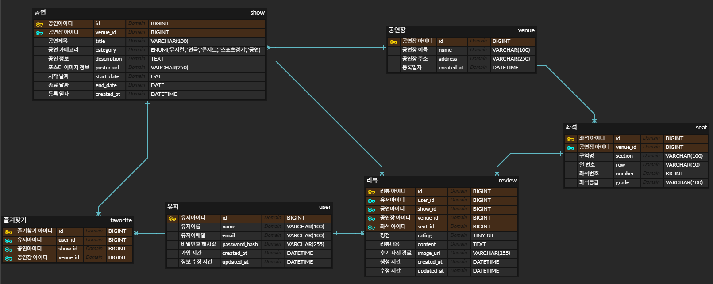

# 🎭 RHYVIEW MAKER

**공연장 / 좌석 리뷰 기반 공연 추천 플랫폼**

사용자가 실제 공연장 좌석 후기(시야, 음향, 편안함 등)를 공유하고,
다른 관람객들은 공연·공연장 선택 시 참고할 수 있는 리뷰 기반 플랫폼입니다.

<br>

## 팀원 구성

- 기획 : 플솝 25 김민우
- frontend : 플솝 25 강연우
- frontend: 플솝 25 진도현
- backend : 글솝 22 유재환

<br>

## 주요기능


🎫 공연(Shows)

- 공연 목록 조회 (포스터, 제목, 카테고리, 공연 기간)
- 공연 상세 페이지

🏟 공연장(Venues)

- 공연장 주소, 기본 정보
- 각 공연장 좌석 등급(VIP/R/S/A) 및 섹션 정보 제공

🪑 좌석 정보(Seats)

- Row/Section별 좌석 상세 정보
- 좌석 등급별 성능 비교 가능

⭐ 리뷰(Reviews)

- 좌석 시야/음향/편안함 리뷰 작성
- 이미지(시야 사진) 업로드 지원
- 공연·공연장·좌석 상세 페이지에서 리뷰 확인 가능

❤️ 찜하기(Favorites)

- 공연/공연장 찜 기능
- 마이페이지에서 찜한 콘텐츠 조회 가능

<br>

<br>

## 기술스택(Tech Stack)
- **Frontend** : React(Vite)
- **Backend** : Node.js, Express,MySQL(mysql2/promise)
- **Infra** : Local MySQL(서버 배포 예정)(옵션)
- **Docs** : Swagger, JSDoc
- **Collaboration** : Notion, Github, Git

<br>


<br>

## ERD

주요 테이블

- users
- venues
- shows
- seats
- reviews
- favorites

<br>



<br>

## 프로젝트 설치

```bash
git clone https://github.com/letsgojh/SamGyeopSal_Get_It.git
cd SamGyeopSal_Get_It
```

## DB 초기화 방법

1. .env설정(./backend/.)

    ```bash
    DB_HOST=localhost
    DB_PORT=3306
    DB_USER=root
    DB_PASS=[비밀번호]
    DB_NAME=theater_app
    ```

2. schema + dummy_data 생성

    ```bash
    npm run db:init
    ```

<br>

<br>


## 실행 방법

- Backend

```bash
cd backend
npm install
npm run start
```

- Frontend

```bash
cd frontend/rhyview-web
npm install
npm install react-router-dom
npm run dev
```


<br>

<br>


## dummy data

- users : 15명
- venues : 5개
- shows : 15개
- seats : venue당 100개
- reviews : venue당 10개

<br>
